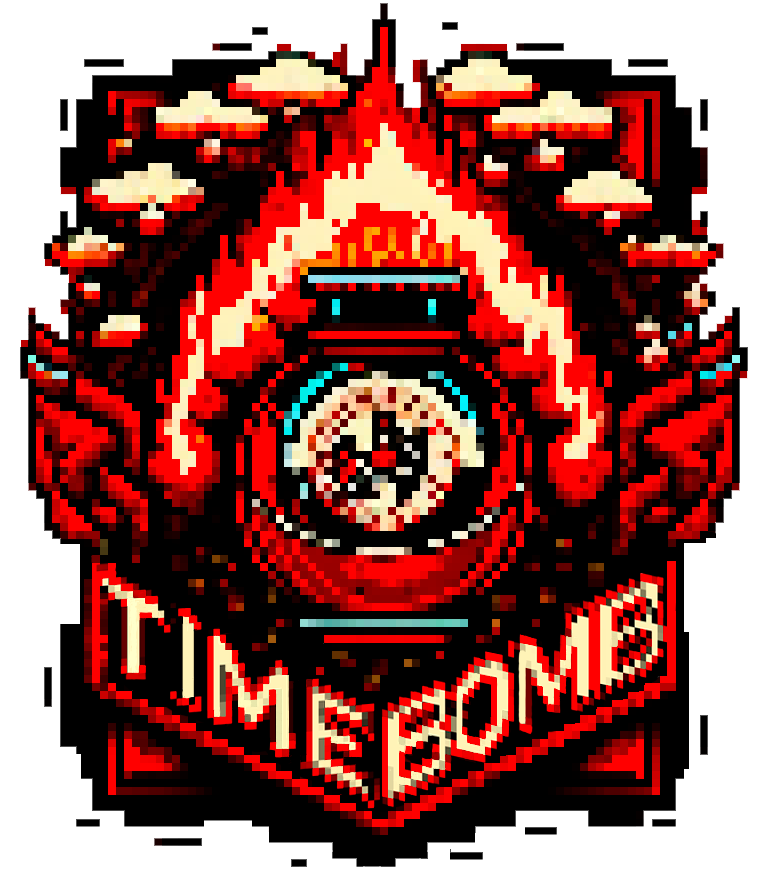
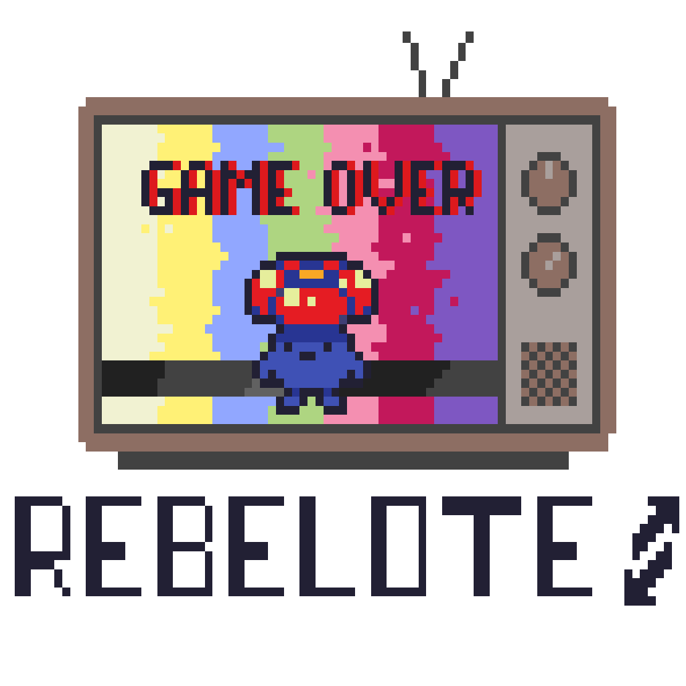

# TimeBomb

Ce jeu a été réalisé durant la Code Game Jam 2023, 7ème édition.
 * Gagnant du `Prix Étudiant` : choix du public.
 * Gagnant du `Prix Coup de Cœur` : choix des professionnels.

### Time Bomb est un platformer 2D dans lequel 2 joueurs en local s'affrontent. 

#### L'objectif : ne pas avoir la bombe à la fin du chrono. 

`Fonctionnalités` : Un des deux joueurs est choisi aléatoirement pour débuter avec la bombe. Il devra poursuivre son adversaire afin de lui donner la bombe. Le joueur n'ayant pas la bombe doit fuir. Lorsque le chrono est terminé, le joueur qui possède la bombe perd une vie. Une partie est consituée de plusieurs rounds qui durent 30 secondes. Chaque joueur possède 3 vies, le jeu s'arrête quand l'un des deux joueurs n'a plus de vie. 

Des `évènements` peuvent survenir pendant la partie, un objet collectable se trouve sur la map. Cet objet, s'il est collecté provoquera un évènement météo aléatoire et influencera la partie. 

Nous abordons le thème `Maître du temps` sous tous les aspects, le temps du chronomètre, le temps météorologique, et enfin le temps du passé et du futur avec les 3 maps représentant chacune un évènement du temps ( époque des dinosaures, époque du Moyen Âge et l'époque futuriste).

https://user-images.githubusercontent.com/91788506/225391648-2481ccd8-6816-4010-9f6a-5b772fd8f694.mp4

### Ce projet a été réalisé en groupe de 6 avec :

`Julie Chevallier` : Développeuse, Graphiste & Cheffe d'équipe
> s'occupe du fonctionnement général du jeu

`Elian Ducheyne` : Développeur
> s'occupe de l'évènement météorologique

`Alexandre Afonso` : Game Designer
> s'occupe du mapping

`Florian Pereau` : Sound Designer
> s'occupe des musiques et sons

`Loris Cazaux` : Développeur
> s'occupe de l'interface utilisateur

`Thomas Nalix` : Game Designer
> aide à la réalisation du mapping

